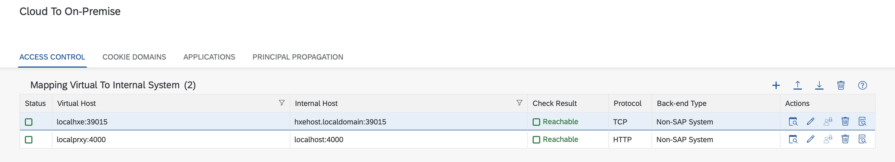

# Example code on how to access on premise systems (HTTP and HANA) via the SAP Cloud Connector using nodejs from Cloud Foundry.
Quick example of how to utilize the cloud connector to connect to an on premise system either for http purposes or sql (hana utilziing the @sap/hana-client module).

The code is based on the code provided in this great blog. Please read this first to get an idea of the what/why and how:
https://blogs.sap.com/2020/08/07/sap-cloud-platform-how-to-call-onprem-system-from-node.js-app-via-cloud-connector

For additional resources 
@sap/hana-client nodejs connection properties:
https://help.sap.com/viewer/f1b440ded6144a54ada97ff95dac7adf/2.7/en-US/4fe9978ebac44f35b9369ef5a4a26f4c.html

Concepts of using the connectivity service on cloud foundry:
https://help.sap.com/viewer/cca91383641e40ffbe03bdc78f00f681/Cloud/en-US/313b215066a8400db461b311e01bd99b.html

To use just clone this repo then 
```
npm install
```
Then create an instance of the connectivity service in the space where you want to deploy the app. Adjust the manifest file to reference the created service and make the respective changes to server.js to reflect your situation. After that:
```
cf push 
```

For reference the cloud connector config that was used:


The first is a local hana express and the second a http endpoint stub to easily test both scenarios (SQLDBC and HTTP). 

Please realize this example does not utilize the destination service which it advised to use as that would then not require hardcoding of URLs in the code. The above mentioned blog shows how to do this.